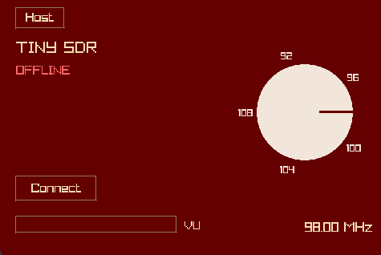

<div align="center">
    
    <h1 align="center">TinySDR</h1>
    <p>Play FM from a rtl-tcp stream with a simple interface</p>
    
</div>


## Features

- Connect to RTL-TCP servers for live FM radio streaming
- Interactive frequency tuning knob (88-108 MHz)
- Real-time VU meter for audio level monitoring
- Configurable host/port settings
- Hardware AGC support
- Clean, minimal interface
> Broadcast radio if on a Raspberry Pi (NOT SUPPORTED ATM)

## Requirements

- Python 3.x
- PyAudio
- PyRay
- NumPy
- SciPy
- RTL-SDR compatible device with RTL-TCP server

## Installation

1. Install the required dependencies & clone the git repo:
```bash
pip install pyaudio pyray numpy scipy
git clone https://github.com/douxxtech/tinysdr
```

2. Set up your RTL-SDR device and start an RTL-TCP server:
```bash
rtl_tcp -a 127.0.0.1 -p 1234
```

## Usage

1. Run the application:
```bash
python main.py
```

2. Click "Connect" to connect to your RTL-TCP server
3. Use the frequency knob to tune to your desired FM station
4. Adjust host/port settings via the "Host" menu if needed

## Configuration

The app automatically saves your settings to `config.json`:
- Host IP address
- Port number  
- Last tuned frequency

## Controls

- **Frequency Knob**: Click and drag to tune between 88-108 MHz
- **Connect Button**: Toggle connection to RTL-TCP server
- **Host Menu**: Access network settings panel
- **VU Meter**: Shows real-time audio signal strength

---

## License
Licensed under [GPLv3.0](LICENSE)

